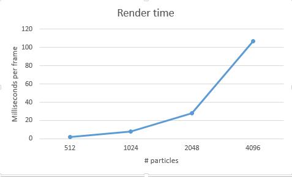

Vulkan Flocking: compute and shading in one pipeline!
======================

**University of Pennsylvania, CIS 565: GPU Programming and Architecture, Project 6**

* Name: Zhan Xiong Chin
* Tested on: Windows 7 Professional, i7-4770 @ 3.40GHz 3.40GHz 16.0GB, Nvidia Quadro K600 1GB (SIG LAB)

### Build instructions
[See here](https://github.com/CIS565-Fall-2016/Project0-CUDA-Getting-Started/blob/master/INSTRUCTION.md). Also needs [LunarG Vulkan SDK](https://vulkan.lunarg.com/).

### Introduction

This is a Vulkan version of a 2D boids simulation (see [here](https://github.com/czxcjx/Project1-CUDA-Flocking) for a 3D CUDA version). Each particle is influenced by 3 different rules: 

* cohesion - boids move towards the center of mass of their neighbors
* separation - boids move away from each of their neighbors
* alignment - boids adjust their velocity to the mean velocity of their neighbors

# Performance analysis

The algorithm implemented is a straightforward naive computation: it parallelizes over each particle, which loops over every other particle and updates its velocity in accordance to the 3 rules. As expected, since the naive algorithm needs O(N^2) time to do the velocity updates, the time required per frame increases by 4 times 

Performance can be improved significantly by using space partitioning data structures (e.g. uniform grid), but these were not implemented in this version. For such a reference, see the 3D CUDA version linked above.

# Answers to questions

* Why do you think Vulkan expects explicit descriptors for things like generating pipelines and commands?
	* This allows for greater control over how Vulkan executes code.
* Describe a situation besides flip-flop buffers in which you may need multiple descriptor sets to fit one descriptor layout.
	* Debug views may be able to make use of multiple descriptor sets, with different buffers (e.g. position, normals, depth) being mapped to colors.
* What are some problems to keep in mind when using multiple Vulkan queues?
	* There may be different limits on the number of allowed Vulkan queues for different systems, so code will have to take that into consideration. Furthermore, synchronization between the different queues may be an issue, as different parts of each queue may have dependencies on each other.
* What is one advantage of using compute commands that can share data with a rendering pipeline?
	* We can perform computations (e.g. updating velocity, position) at the same time as rendering data to screen.

### Credits

* [Vulkan examples and demos](https://github.com/SaschaWillems/Vulkan) by [@SaschaWillems](https://github.com/SaschaWillems)
